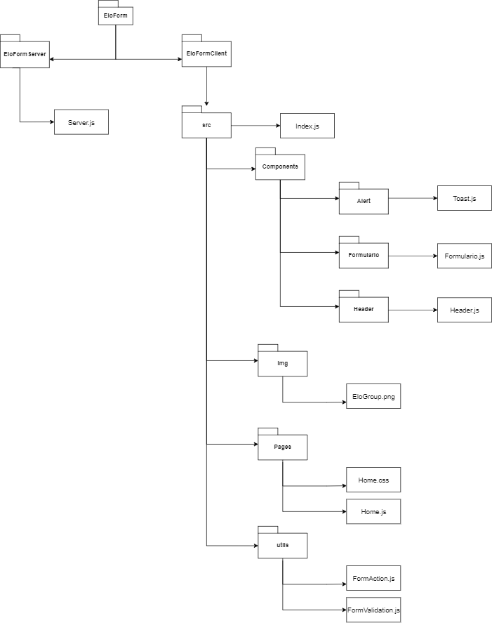

 
# EloForm
 
Este formulário utiliza a biblioteca React para javaScript, juntamente do framework Material-UI no lado do cliente. No lado do servidor fpoi utilizado o NodeJS com o framework ExpressJs.
 
Para realizar esse formulário, foram feitos 2 projetos. O primeiro sendo o lado do cliente e o segundo sendo o lado do servidor. Portanto para que a aplicação funcione de forma completa é necessário rodar os dois projetos.
 
O lado do cliente recebe os dados digitados pelo usuário, o node recebe esses dados e envia pelo método POST um JSON contendo essas informações e essas são enviadas para o "localhost:8080" onde são exibidas.
 
 
## Para rodar:
 
- Primeiramente é necessário instalar o node para seu SO
- Entrar no diretório EloForm
- Abrir simultaneamente em janelas de terminal diferentes os diretórios EloFormClient e EloFormServer
- Realizar nas duas janelas de terminal o comando **npm install** para realizar a instalação das dependências de cada projeto.
- Para iniciar a aplicação digite **npm start** na janela de terminal do servidor
    - Abra o localhost:8080 no seu browser
- Inicie a o cliente, digitando o comando **npm start** na janela do terminal do EloFormClient
    - Irá abrir o formulário na porta 3000
- Preencha o formulário e envie clicando no botão "send"
- Troque para a aba onde está rodando o localhost:8080 e aperte F5 para recarregar a página
    - Observe que os dados apareceram
 

 ## Hierarquia de Pastas

 
## GUPY
 
Nome no GUPY: Luísa Figueiredo Corrêa
